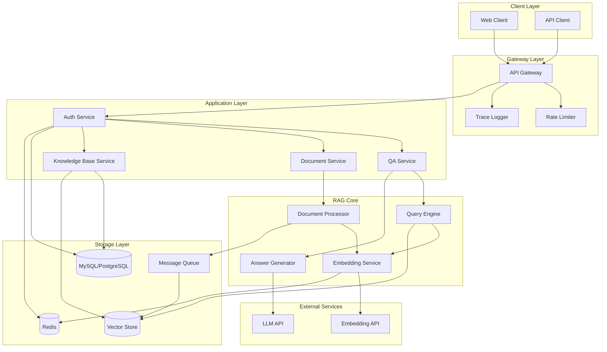
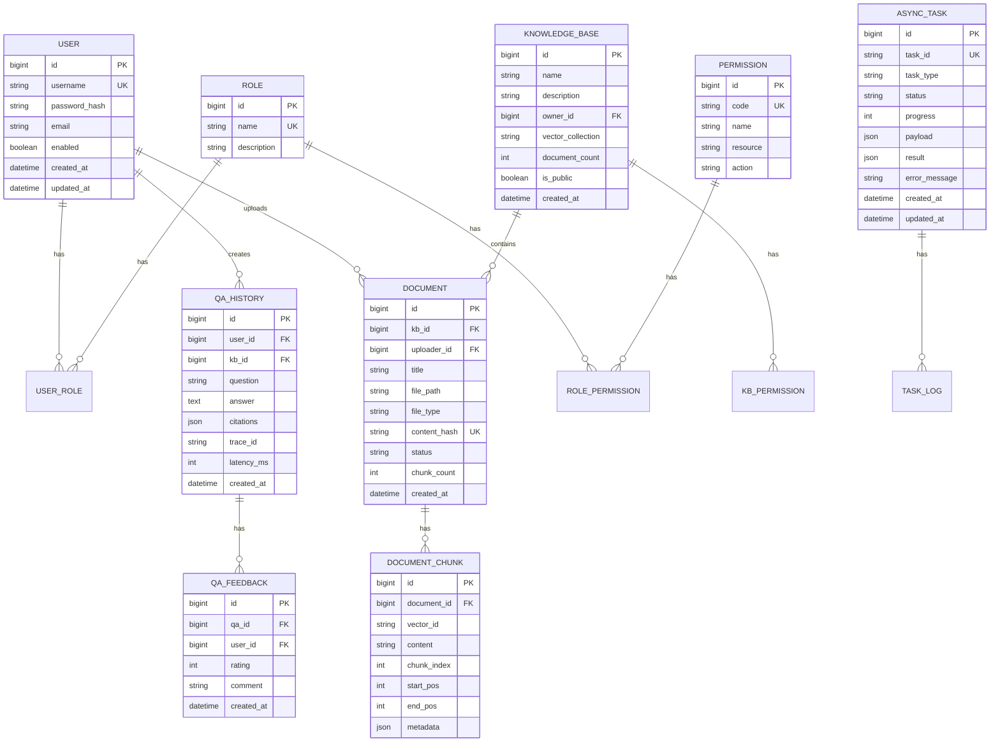

# Design Document: Enterprise RAG QA System

## Overview

本设计文档描述企业内部 AI 驱动的技术文档与代码知识库问答系统的技术架构和实现方案。系统采用 Spring Boot 3.x 作为后端框架，通过自主实现的 RAG 流程提供智能问答能力。

### 核心设计原则

1. **模块化设计**：各组件职责单一，便于维护和扩展
2. **可插拔架构**：向量数据库、嵌入模型等支持多种实现
3. **高可用性**：异步处理、缓存、限流保障系统稳定
4. **可观测性**：完整的链路追踪和日志体系

## Architecture

### 系统架构图



### 分层架构

```
┌─────────────────────────────────────────────────────────────┐
│                    Presentation Layer                        │
│  (REST Controllers, Request/Response DTOs, Validation)       │
├─────────────────────────────────────────────────────────────┤
│                    Application Layer                         │
│  (Service Facades, Use Cases, Transaction Management)        │
├─────────────────────────────────────────────────────────────┤
│                      Domain Layer                            │
│  (Domain Models, Domain Services, Repository Interfaces)     │
├─────────────────────────────────────────────────────────────┤
│                   Infrastructure Layer                       │
│  (Repository Impl, External APIs, Cache, MQ, Vector Store)   │
└─────────────────────────────────────────────────────────────┘
```

## Components and Interfaces

### 1. 认证授权模块 (Auth Module)

```java
// 认证服务接口
public interface AuthService {
    AuthResponse login(LoginRequest request);
    AuthResponse refreshToken(String refreshToken);
    void logout(String accessToken);
    UserDetails validateToken(String token);
}

// JWT Token 管理
public interface JwtTokenProvider {
    String generateAccessToken(UserDetails user);
    String generateRefreshToken(UserDetails user);
    Claims parseToken(String token);
    boolean isTokenValid(String token);
    void blacklistToken(String token);
}

// 认证响应
public record AuthResponse(
    String accessToken,
    String refreshToken,
    long expiresIn,
    UserInfo userInfo
) {}
```

### 2. 文档处理模块 (Document Processing Module)

```java
// 文档处理器接口
public interface DocumentProcessor {
    ProcessResult process(DocumentInput input);
    List<DocumentChunk> chunk(String content, ChunkConfig config);
}

// 文档解析器（策略模式）
public interface DocumentParser {
    String parse(InputStream input);
    boolean supports(String fileType);
}

// 文档分块配置
public record ChunkConfig(
    int chunkSize,
    int chunkOverlap,
    ChunkStrategy strategy
) {}

// 文档块
public record DocumentChunk(
    String id,
    String content,
    int startIndex,
    int endIndex,
    Map<String, Object> metadata
) {}
```

### 3. 向量嵌入模块 (Embedding Module)

```java
// 嵌入服务接口
public interface EmbeddingService {
    float[] embed(String text);
    List<float[]> embedBatch(List<String> texts);
}

// 嵌入提供者（支持多种实现）
public interface EmbeddingProvider {
    float[] getEmbedding(String text);
    int getDimension();
    String getModelName();
}

// OpenAI 实现
public class OpenAIEmbeddingProvider implements EmbeddingProvider { }

// 通义实现
public class QwenEmbeddingProvider implements EmbeddingProvider { }

// BGE 本地模型实现
public class BGEEmbeddingProvider implements EmbeddingProvider { }
```

### 4. 向量存储模块 (Vector Store Module)

```java
// 向量存储接口
public interface VectorStore {
    void upsert(String collectionName, List<VectorDocument> documents);
    List<SearchResult> search(String collectionName, float[] queryVector, SearchOptions options);
    void delete(String collectionName, List<String> ids);
    void createCollection(String name, int dimension);
}

// 向量文档
public record VectorDocument(
    String id,
    float[] vector,
    String content,
    Map<String, Object> metadata
) {}

// 搜索结果
public record SearchResult(
    String id,
    String content,
    float score,
    Map<String, Object> metadata
) {}

// 搜索选项
public record SearchOptions(
    int topK,
    float minScore,
    Map<String, Object> filter
) {}
```

### 5. RAG 核心模块 (RAG Core Module)

```java
// 查询引擎
public interface QueryEngine {
    List<RetrievedContext> retrieve(String query, RetrieveOptions options);
}

// 答案生成器
public interface AnswerGenerator {
    GeneratedAnswer generate(String query, List<RetrievedContext> contexts);
}

// RAG 服务（门面）
public interface RAGService {
    QAResponse ask(QARequest request);
}

// 检索上下文
public record RetrievedContext(
    String content,
    String source,
    float relevanceScore,
    Map<String, Object> metadata
) {}

// 生成的答案
public record GeneratedAnswer(
    String answer,
    List<Citation> citations,
    Map<String, Object> metadata
) {}

// 引用来源
public record Citation(
    String source,
    String snippet,
    int startIndex,
    int endIndex
) {}
```

### 6. 限流模块 (Rate Limiting Module)

```java
// 限流器接口
public interface RateLimiter {
    RateLimitResult tryAcquire(String key, RateLimitConfig config);
}

// 限流结果
public record RateLimitResult(
    boolean allowed,
    long remaining,
    long resetTime,
    long retryAfter
) {}

// 限流配置
public record RateLimitConfig(
    int maxRequests,
    long windowSeconds,
    RateLimitStrategy strategy
) {}

// 限流策略
public enum RateLimitStrategy {
    SLIDING_WINDOW,
    TOKEN_BUCKET,
    FIXED_WINDOW
}
```

### 7. 幂等性模块 (Idempotency Module)

```java
// 幂等性处理器
public interface IdempotencyHandler {
    <T> IdempotencyResult<T> execute(String idempotencyKey, Supplier<T> operation);
    boolean exists(String idempotencyKey);
}

// 幂等性结果
public record IdempotencyResult<T>(
    boolean isNew,
    T result,
    Instant processedAt
) {}
```

### 8. 链路追踪模块 (Trace Module)

```java
// 追踪上下文
public interface TraceContext {
    String getTraceId();
    String getSpanId();
    void setTraceId(String traceId);
    void setSpanId(String spanId);
}

// MDC 追踪过滤器
public class TraceFilter extends OncePerRequestFilter {
    @Override
    protected void doFilterInternal(HttpServletRequest request, 
                                    HttpServletResponse response, 
                                    FilterChain filterChain) {
        String traceId = generateOrExtractTraceId(request);
        MDC.put("traceId", traceId);
        response.setHeader("X-Trace-Id", traceId);
        try {
            filterChain.doFilter(request, response);
        } finally {
            MDC.clear();
        }
    }
}
```

### 9. 异步任务模块 (Async Task Module)

```java
// 异步任务管理器
public interface AsyncTaskManager {
    <T> TaskHandle<T> submit(AsyncTask<T> task);
    TaskStatus getStatus(String taskId);
    <T> T getResult(String taskId);
}

// 任务句柄
public record TaskHandle<T>(
    String taskId,
    CompletableFuture<T> future
) {}

// 任务状态
public record TaskStatus(
    String taskId,
    TaskState state,
    int progress,
    String message,
    Instant createdAt,
    Instant updatedAt
) {}

public enum TaskState {
    PENDING, RUNNING, COMPLETED, FAILED, CANCELLED
}
```

## Data Models

### 数据库 ER 图



### 核心实体类

```java
// 用户实体
@Entity
@Table(name = "user")
public class User {
    @Id
    @GeneratedValue(strategy = GenerationType.IDENTITY)
    private Long id;
    
    @Column(unique = true, nullable = false)
    private String username;
    
    @Column(nullable = false)
    private String passwordHash;
    
    private String email;
    private Boolean enabled;
    
    @ManyToMany(fetch = FetchType.LAZY)
    @JoinTable(name = "user_role")
    private Set<Role> roles;
    
    private LocalDateTime createdAt;
    private LocalDateTime updatedAt;
}

// 知识库实体
@Entity
@Table(name = "knowledge_base")
public class KnowledgeBase {
    @Id
    @GeneratedValue(strategy = GenerationType.IDENTITY)
    private Long id;
    
    @Column(nullable = false)
    private String name;
    
    private String description;
    
    @ManyToOne(fetch = FetchType.LAZY)
    @JoinColumn(name = "owner_id")
    private User owner;
    
    private String vectorCollection;
    private Integer documentCount;
    private Boolean isPublic;
    private LocalDateTime createdAt;
}

// 文档实体
@Entity
@Table(name = "document")
public class Document {
    @Id
    @GeneratedValue(strategy = GenerationType.IDENTITY)
    private Long id;
    
    @ManyToOne(fetch = FetchType.LAZY)
    @JoinColumn(name = "kb_id")
    private KnowledgeBase knowledgeBase;
    
    @ManyToOne(fetch = FetchType.LAZY)
    @JoinColumn(name = "uploader_id")
    private User uploader;
    
    private String title;
    private String filePath;
    private String fileType;
    
    @Column(unique = true)
    private String contentHash;
    
    @Enumerated(EnumType.STRING)
    private DocumentStatus status;
    
    private Integer chunkCount;
    private LocalDateTime createdAt;
}

// 问答历史实体
@Entity
@Table(name = "qa_history")
public class QAHistory {
    @Id
    @GeneratedValue(strategy = GenerationType.IDENTITY)
    private Long id;
    
    @ManyToOne(fetch = FetchType.LAZY)
    @JoinColumn(name = "user_id")
    private User user;
    
    @ManyToOne(fetch = FetchType.LAZY)
    @JoinColumn(name = "kb_id")
    private KnowledgeBase knowledgeBase;
    
    @Column(nullable = false)
    private String question;
    
    @Column(columnDefinition = "TEXT")
    private String answer;
    
    @Type(JsonType.class)
    @Column(columnDefinition = "json")
    private List<Citation> citations;
    
    private String traceId;
    private Integer latencyMs;
    private LocalDateTime createdAt;
}
```

### Redis 数据结构

```
# JWT Token 黑名单
SET token:blacklist:{tokenHash} "" EX {remainingTTL}

# 用户会话
HASH session:{userId}
  - accessToken: {token}
  - refreshToken: {token}
  - loginTime: {timestamp}
  - lastActiveTime: {timestamp}

# 限流计数器（滑动窗口）
ZSET ratelimit:{dimension}:{key}
  - member: {requestId}
  - score: {timestamp}

# 幂等性键
STRING idempotency:{key} {resultJson} EX 86400

# 嵌入缓存
STRING embedding:{contentHash} {vectorJson} EX 3600

# 查询结果缓存
STRING qa:cache:{queryHash}:{kbId} {resultJson} EX 1800
```


## Correctness Properties

*A property is a characteristic or behavior that should hold true across all valid executions of a system—essentially, a formal statement about what the system should do. Properties serve as the bridge between human-readable specifications and machine-verifiable correctness guarantees.*


### Property 1: JWT Token 往返一致性

*For any* 有效的用户凭证，生成 JWT Token 后再验证该 Token，应该能正确识别用户身份并允许访问。

**Validates: Requirements 1.1, 1.2**

### Property 2: 无效 Token 拒绝

*For any* 无效的 JWT Token（过期、篡改、格式错误），验证时应返回 401 状态码并拒绝访问。

**Validates: Requirements 1.3**

### Property 3: Token 刷新有效性

*For any* 有效的 Refresh Token，刷新后生成的新 Access Token 应该是有效的且能通过验证。

**Validates: Requirements 1.4**

### Property 4: Token 黑名单有效性

*For any* 已登出的 Token，该 Token 应被加入黑名单，后续使用该 Token 的请求应被拒绝。

**Validates: Requirements 1.5**

### Property 5: 文档解析完整性

*For any* 支持格式的文档文件（PDF/Markdown/Word/代码），解析后提取的文本应包含文档的主要内容。

**Validates: Requirements 2.1**

### Property 6: 文档分块覆盖性

*For any* 文档内容，分块后所有块的内容拼接应能覆盖原始内容（考虑重叠部分），且每个块大小不超过配置的最大值。

**Validates: Requirements 2.2**

### Property 7: 向量存储完整性

*For any* 存储到向量数据库的文档块，应能通过 ID 检索到完整的向量数据和元数据。

**Validates: Requirements 2.4, 4.2**

### Property 8: 文档上传幂等性

*For any* 文档，重复上传相同内容的文档（相同 content hash）不应产生重复的索引数据。

**Validates: Requirements 2.6**

### Property 9: 嵌入向量有效性

*For any* 非空文本输入，Embedding Service 返回的向量应具有正确的维度且所有元素非 NaN。

**Validates: Requirements 3.2**

### Property 10: 嵌入缓存一致性

*For any* 文本输入，多次调用 Embedding Service 应返回相同的向量结果（缓存命中）。

**Validates: Requirements 3.4**

### Property 11: 向量搜索排序正确性

*For any* 向量搜索请求，返回的结果应按相似度分数降序排列，且结果数量不超过请求的 Top-K。

**Validates: Requirements 4.3**

### Property 12: 向量搜索过滤正确性

*For any* 带元数据过滤条件的搜索请求，返回的所有结果都应满足过滤条件。

**Validates: Requirements 4.4**

### Property 13: Prompt 上下文包含性

*For any* 检索到的上下文文档，构建的 Prompt 应包含这些文档的内容。

**Validates: Requirements 5.2**

### Property 14: 问答响应完整性

*For any* 成功的问答请求，响应应包含非空答案和引用来源列表。

**Validates: Requirements 5.4**

### Property 15: 限流阈值正确性

*For any* 限流配置，当请求数超过阈值时，后续请求应返回 429 状态码。

**Validates: Requirements 6.2**

### Property 16: 限流响应头完整性

*For any* 被限流的请求，响应头应包含剩余配额（X-RateLimit-Remaining）和重置时间（X-RateLimit-Reset）。

**Validates: Requirements 6.4**

### Property 17: 幂等性处理正确性

*For any* 带幂等性 Key 的写操作请求，使用相同 Key 重复请求应返回与首次请求相同的结果。

**Validates: Requirements 7.2, 7.3**

### Property 18: TraceId 唯一性

*For any* 进入系统的请求，生成的 TraceId 应是唯一的（在合理时间窗口内不重复）。

**Validates: Requirements 8.1**

### Property 19: 异步任务提交即时性

*For any* 提交的异步任务，应立即返回任务 ID，且任务 ID 可用于后续状态查询。

**Validates: Requirements 9.2**

### Property 20: 任务状态查询完整性

*For any* 已提交的任务 ID，查询状态应返回包含任务状态、进度和结果（如已完成）的完整信息。

**Validates: Requirements 9.3**

### Property 21: 查询缓存有效性

*For any* 相同的问答查询（相同问题和知识库），第二次查询应命中缓存且响应时间显著减少。

**Validates: Requirements 10.1**

### Property 22: 知识库 CRUD 一致性

*For any* 知识库，创建后应能查询到，更新后应反映新值，删除后应不可查询。

**Validates: Requirements 11.1**

### Property 23: 文档删除级联性

*For any* 被删除的文档，其对应的向量数据也应被删除，搜索时不应返回该文档的内容。

**Validates: Requirements 11.2**

### Property 24: 知识库权限隔离性

*For any* 非公开知识库，无权限的用户不应能访问其内容或执行问答。

**Validates: Requirements 11.3**

### Property 25: 统计信息一致性

*For any* 知识库，统计信息（文档数、向量数）应与实际存储的数据一致。

**Validates: Requirements 11.4**

### Property 26: 问答历史记录完整性

*For any* 成功的问答请求，应在历史记录中保存问题、答案和引用来源。

**Validates: Requirements 12.1**

### Property 27: 分页查询正确性

*For any* 分页查询请求，返回的记录数应不超过页大小，且按时间倒序排列。

**Validates: Requirements 12.2**

### Property 28: 反馈保存正确性

*For any* 用户提交的反馈，应能通过问答 ID 查询到该反馈记录。

**Validates: Requirements 12.3**

## Error Handling

### 认证错误

| 错误场景 | HTTP 状态码 | 错误码 | 处理方式 |
|---------|------------|--------|---------|
| 用户名或密码错误 | 401 | AUTH_001 | 返回通用认证失败消息 |
| Token 过期 | 401 | AUTH_002 | 提示刷新 Token |
| Token 无效 | 401 | AUTH_003 | 要求重新登录 |
| 权限不足 | 403 | AUTH_004 | 返回权限不足提示 |

### 业务错误

| 错误场景 | HTTP 状态码 | 错误码 | 处理方式 |
|---------|------------|--------|---------|
| 文档格式不支持 | 400 | DOC_001 | 返回支持的格式列表 |
| 文档过大 | 413 | DOC_002 | 返回大小限制信息 |
| 知识库不存在 | 404 | KB_001 | 返回资源不存在 |
| 向量服务不可用 | 503 | VEC_001 | 返回服务暂时不可用 |
| LLM 服务不可用 | 503 | LLM_001 | 返回服务暂时不可用 |

### 限流错误

| 错误场景 | HTTP 状态码 | 错误码 | 处理方式 |
|---------|------------|--------|---------|
| 请求过于频繁 | 429 | RATE_001 | 返回重试时间 |

### 全局异常处理

```java
@RestControllerAdvice
public class GlobalExceptionHandler {
    
    @ExceptionHandler(AuthenticationException.class)
    public ResponseEntity<ErrorResponse> handleAuthException(AuthenticationException e) {
        return ResponseEntity.status(HttpStatus.UNAUTHORIZED)
            .body(new ErrorResponse("AUTH_001", "认证失败"));
    }
    
    @ExceptionHandler(RateLimitExceededException.class)
    public ResponseEntity<ErrorResponse> handleRateLimitException(RateLimitExceededException e) {
        return ResponseEntity.status(HttpStatus.TOO_MANY_REQUESTS)
            .header("X-RateLimit-Remaining", "0")
            .header("X-RateLimit-Reset", String.valueOf(e.getResetTime()))
            .header("Retry-After", String.valueOf(e.getRetryAfter()))
            .body(new ErrorResponse("RATE_001", "请求过于频繁，请稍后重试"));
    }
    
    @ExceptionHandler(BusinessException.class)
    public ResponseEntity<ErrorResponse> handleBusinessException(BusinessException e) {
        return ResponseEntity.status(e.getHttpStatus())
            .body(new ErrorResponse(e.getErrorCode(), e.getMessage()));
    }
}
```

## Testing Strategy

### 测试框架选择

- **单元测试**: JUnit 5 + Mockito
- **属性测试**: jqwik (Java Property-Based Testing)
- **集成测试**: Spring Boot Test + Testcontainers
- **API 测试**: REST Assured

### 测试分层

```
┌─────────────────────────────────────────┐
│           E2E Tests (少量)              │
│     验证完整业务流程                      │
├─────────────────────────────────────────┤
│        Integration Tests (中量)          │
│   验证组件间交互、数据库、缓存             │
├─────────────────────────────────────────┤
│         Property Tests (中量)            │
│   验证核心逻辑的通用属性                   │
├─────────────────────────────────────────┤
│          Unit Tests (大量)               │
│   验证单个类/方法的行为                    │
└─────────────────────────────────────────┘
```

### 属性测试配置

```java
// jqwik 配置
@PropertyDefaults(tries = 100)
public class PropertyTestConfig {
    // 每个属性测试运行 100 次
}
```

### 测试覆盖要求

- 单元测试覆盖率 > 80%
- 所有正确性属性必须有对应的属性测试
- 关键业务流程必须有集成测试
- API 接口必须有契约测试

### 属性测试示例

```java
// Feature: enterprise-rag-qa-system, Property 6: 文档分块覆盖性
@Property(tries = 100)
void chunksShouldCoverOriginalContent(
    @ForAll @StringLength(min = 100, max = 10000) String content,
    @ForAll @IntRange(min = 100, max = 500) int chunkSize,
    @ForAll @IntRange(min = 10, max = 50) int overlap
) {
    ChunkConfig config = new ChunkConfig(chunkSize, overlap, ChunkStrategy.SEMANTIC);
    List<DocumentChunk> chunks = documentProcessor.chunk(content, config);
    
    // 验证所有块拼接后覆盖原始内容
    String reconstructed = reconstructContent(chunks);
    assertThat(reconstructed).contains(content.substring(0, Math.min(100, content.length())));
    
    // 验证每个块大小不超过配置
    chunks.forEach(chunk -> 
        assertThat(chunk.content().length()).isLessThanOrEqualTo(chunkSize)
    );
}

// Feature: enterprise-rag-qa-system, Property 17: 幂等性处理正确性
@Property(tries = 100)
void idempotencyKeyShouldReturnSameResult(
    @ForAll @AlphaNumeric @StringLength(min = 10, max = 50) String idempotencyKey,
    @ForAll @AlphaNumeric @StringLength(min = 1, max = 100) String payload
) {
    // 首次请求
    var firstResult = idempotencyHandler.execute(idempotencyKey, () -> processPayload(payload));
    
    // 重复请求
    var secondResult = idempotencyHandler.execute(idempotencyKey, () -> processPayload(payload));
    
    // 验证结果相同
    assertThat(secondResult.result()).isEqualTo(firstResult.result());
    assertThat(secondResult.isNew()).isFalse();
}
```
