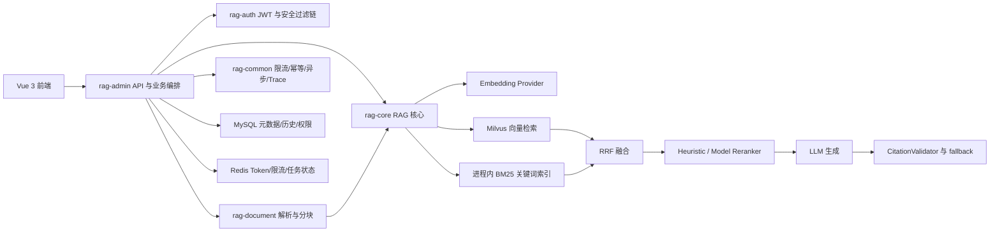

# RAG 项目现状、简历对照与暑期迭代学习交接稿

> 更新时间：2026-07-12
>
> 仓库：`C:\_01_Code\RAG`
>
> 当前分支：`feature/pr2-rag-eval`
>
> 当前实现验收基线：`5293c53 fix(配置): 放宽复杂问答生成超时至120秒`
>
> 用途：将本文完整发送给 Web 端 GPT，作为后续暑期项目迭代、逆向学习和面试训练的统一上下文。

## 1. 我的背景与目标

- 软件工程本科在读，目标方向是 Java 后端、AI 应用工程、RAG 工程。
- 项目主要借助 Codex、Claude 等 Agent 工具完成，当前最大目标是利用暑期时间将项目再迭代一遍，让其符合2026年乃至2027年的技术发展前景，如Agentic RAG等，同时逐渐把已经存在的代码逆向学透。
- 面试目标：简历中的每一句项目话术都能回答“为什么这样设计、代码在哪里、如何验证、失败时如何排查、还有什么边界”。

## 2. 项目一句话定位

这是一个面向企业内部知识库的全栈 RAG 问答系统，已具备文档上传、异步解析分块、Embedding、Milvus 向量检索、BM25 + RRF 混合检索、启发式/模型重排抽象、同步与 SSE 问答、引用校验、JWT 鉴权、知识库权限、历史反馈和自动评测。

当前项目不是从零搭建阶段，而是处于：

**检索质量工程第一轮和生成/引用质量 Stage 1 已完成，真实 reranker、分块专项、文档真相源清理、生产化与个人掌握度仍待补齐。**

## 3. 当前代码规模与技术栈

### 3.1 规模快照

- 后端 5 个 Maven 模块，共 203 个 `src/main` Java 源文件。
- 约 40 个测试 Java 文件，其中 12 个 jqwik 属性测试文件。
- 在 `*Test.java` 中扫描到约 151 个 `@Test` / `@Property` / `@Example` 测试入口。
- 前端 `rag-frontend/src` 下约 58 个源文件。
- 评测集 30 条：27 条可回答问题，3 条 no-answer 问题。

注意：简历中的“约 200 个业务类”不够严谨。203 是后端主代码 Java 文件总数，其中包含配置、DTO、实体、接口和基础设施类，建议改成“约 200 个后端 Java 源文件”。

### 3.2 技术栈

- Java 17、Spring Boot 3.2.1、Spring Security、MyBatis-Plus、Flyway。
- MySQL、Redis、Milvus；代码中另有 Qdrant、Elasticsearch 适配，但当前默认和真实验证对象是 Milvus。
- OpenAI-compatible / Qwen LLM，OpenAI-compatible / Qwen / BGE Embedding 配置。
- WebClient、Reactor Flux、SseEmitter。
- Vue 3、TypeScript、Vite、Pinia、Vue Router、Element Plus。
- jqwik、JUnit、Python 评测脚本、Docker Compose。

## 4. 架构地图

### 4.1 模块职责

| 模块 | 当前真实职责 | 逆向学习入口 |
|---|---|---|
| `rag-common` | 统一响应、异常、Redis、滑动窗口限流、幂等、异步任务、Trace | `ratelimit/`、`idempotency/`、`async/`、`trace/` |
| `rag-auth` | JWT 签发与解析、认证过滤器、Token 黑名单、Spring Security | `SecurityConfig`、`JwtAuthenticationFilter`、`JwtTokenProvider` |
| `rag-document` | PDF/DOCX/Markdown/TXT/代码解析，token 预算分块，哈希去重 | `DocumentProcessorImpl`、`ChunkConfig`、各 Parser |
| `rag-core` | Embedding、向量库适配、查询变体、BM25、RRF、rerank、prompt、生成、引用 | `QueryEngineImpl`、`AnswerGeneratorImpl`、`CitationValidator` |
| `rag-admin` | 启动入口、Controller、知识库/文档/权限/历史业务编排 | `QAController`、`DocumentIndexingServiceImpl`、`KBPermissionServiceImpl` |
| `rag-frontend` | 登录、知识库、上传、问答、历史、引用展示 | `router/index.ts`、`ChatPanel.vue`、`useSSE.ts` |

## 5. 端到端主链路

1. 用户通过 JWT 登录，访问知识库时校验 owner/public/READ/WRITE/ADMIN 权限。
2. 上传文档后返回 `taskId`，异步任务执行解析、哈希、分块、Embedding、Milvus 入库、BM25 索引更新和数据库记录更新。
3. 提问时生成动态查询变体，每个变体执行向量检索并按 chunk id 去重。
4. 原问题再走 BM25 关键词路线，向量路线和关键词路线使用 RRF 融合。
5. 默认使用 heuristic reranker；真实模型 reranker 已有 HTTP adapter，但默认关闭。
6. 将最终上下文交给 LLM，生成答案后执行引用提取、回连校验和 grounded fallback。
7. 同步接口返回答案、引用和上下文；流式接口通过 `SseEmitter` 发送内容并保存历史。
8. Python runner 分别评测 retrieval-only 和 generation/citation，报告状态区分 `CLEAN`、`PARTIAL`、`RETRIEVAL_ONLY`、`FAILED`。

## 6. 已实现且有证据的能力

### 6.1 文档与索引

- 支持 PDF、DOCX、Markdown、TXT 和代码文件；不应宣称支持旧 `.doc`。
- 当前运行时分块参数为 `420 / 80`，含义是由 `TokenCounter` 估算的 token 预算。
- `DocumentProcessorImpl` 仍有进程内哈希去重；`DocumentIndexingServiceImpl` 额外通过数据库按 `(kbId, contentHash)` 查询，解决重启后内存记录丢失的问题。
- 分块标题感知、长代码块和长段落专项尚未完成，是后续 v4 Stage 3 的任务。

### 6.2 检索

- Query 变体是真实现，但数量由问题结构和同义词动态决定，代码没有固定“7~10 路”上限。
- 向量检索和 BM25 关键词检索均已接入，默认启用 hybrid。
- 两路结果使用 RRF 融合，当前 `rrf-k=60`。
- heuristic reranker 的公式确实是：向量/检索分 `0.7` + 关键词覆盖分 `0.3`。
- `ModelReranker` 不再只是“预留扩展点”，已经是带健康检查、超时和降级的 HTTP adapter；但真实 provider 的业务收益尚未验证，默认仍是 heuristic。

### 6.3 生成、引用与流式输出

- 同步和流式 OpenAI-compatible/Qwen 调用均存在，包含 timeout、429/5xx/网络错误重试和脱敏诊断。
- `CitationValidator` 会校验引用是否来自本轮 retrieved contexts，无答案时禁止携带 citation。
- 当模型答案没有可解析引用时，系统可以从本轮上下文构造 grounded citation fallback，再次经过 validator。
- `StreamSanitizer` 能处理 `[Source N]` 标记跨多个流式 chunk 被拆开的情况。
- `QAController` 使用 `SseEmitter`，并处理订阅释放、超时、错误提示和历史保存。

### 6.4 安全与工程能力

- Spring Security + JWT + Redis Token 黑名单是真实链路。
- 知识库权限支持 owner/public 和 READ/WRITE/ADMIN 层级。
- `@RateLimit`、`@Idempotent`、异步任务状态、TraceId 均有实现和测试。
- jqwik 属性测试覆盖异步任务、限流、幂等、Trace、JWT、Token 黑名单、文档处理、Embedding、RAG、向量库、知识库和问答历史等不变量。

## 7. 当前优化阶段

### 7.1 已完成的 v3 检索质量工程

| 项目 | 当前结论 |
|---|---|
| 固定评测身份 | 固定 KB、fixture、配置快照和 Git HEAD，可重复运行 |
| Hybrid | BM25 + dense vector + RRF 已完成并默认开启 |
| 分块矩阵 | 对比 `500/50`、`640/96`、`700/100`、`420/80` |
| 当前采用值 | `420/80`，50 chunks |
| 当前可靠 retrieval 指标 | Recall@5 `68.63%`，MRR `0.7346`，Top1 source accuracy `96.30%` |
| Reranker | HTTP model adapter 已实现，默认 heuristic，真实收益未验证 |

这些指标只适用于固定的 30 条开发评测集，不代表生产数据上的绝对效果。

### 7.2 已完成的 v4 Stage 1

目标是补齐 generation/citation 质量闭环：citation hit、snippet hit、no-answer accuracy，并为可选 faithfulness/relevance judge 建立安全入口。

已完成并真实验证：

- generation/citation runner、可选 LLM-as-judge、调用量 plan、只读 preflight 和 `--keep-existing` 无副作用复用安全闸。
- LLM 错误诊断已贯通后端响应与 Python 报告。
- no-answer 固定拒答协议、citation fallback 抑制和 `metadata.status=no_result` 已通过 Java/Python 回归与真实 3 题验收。
- 当前稳定生成模型为 `qwen/qwen3.5-122b-a10b`，后端超时 `120s`、内部重试 `0`；旧 `qwen3-next-80b` 在最小请求和真实 no-answer 中持续超时，已不再作为默认模型。
- 固定 KB id=11、50 chunks；两轮完整 30 条 objective baseline 均为 `CLEAN`，Recall@5 `68.63%`、MRR `0.7346`、Top1 `96.30%`、no-answer `100%`、snippet hit `100%`、unsupported citation `0`。
- 两轮 citation source hit 分别为 `83.33% / 86.67%`，每轮各有 2 次 provider 长尾/5xx 经 runner 单次重试成功；provider 抖动仍需在生产化阶段治理。
- Maven 155 tests 与 Python 25 tests 全部通过。
- LLM judge 本轮保持 `off`，不得宣称已获得独立 faithfulness/relevance 结论。

### 7.3 后续 v4 阶段

1. Stage 2：当前没有真实 rerank provider/凭据，按 v4 条件触发规则记录为跳过；取得 provider 后再做 heuristic vs model A/B。
2. Stage 3：标题感知、长代码块、长段落分块专项，限制实验次数，不改稳定默认值。
3. Stage 4：归档过时文档，让 `docs/optimization/` 成为唯一权威真相源。
4. 后续生产化：provider 延迟/成功率、成本、熔断与更强集成测试。

## 8. 简历逐条对照

| 简历话术 | 判定 | 当前事实与修改建议 |
|---|---|---|
| Maven 五模块，约 200 个业务类 | 部分准确 | 五模块正确；应改为“约 200 个后端 Java 源文件”，避免把 DTO/配置也叫业务类 |
| 异步索引、taskId、多格式解析、语义分块 | 可保留 | 都有代码；补充当前是 token 预算 `420/80` |
| DB 级 `(kbId, contentHash)` 哈希兜底 | 可保留 | 业务层确实按 KB 和 hash 查询；不要说数据库唯一约束，当前未发现该联合唯一索引 |
| 单问题生成 7~10 路查询变体 | 需改写 | 变体是动态规则生成，没有固定 7~10；改成“规则化多查询变体召回”更准确 |
| 启发式重排 0.7 + 0.3 | 可保留 | 与 `HeuristicReranker` 一致 |
| 预留 BGE-Reranker 扩展点 | 已过时 | 已经实现通用 HTTP `ModelReranker`，但真实 provider 未验证；不要直接写“BGE 已接入并提效” |
| CitationValidator 缓解幻觉 | 可保留但需限定 | 能证明 citation 可回连上下文，不能证明答案每句话都被证据蕴含 |
| SSE 安全上下文问题与 SseEmitter 修复 | 可保留 | Controller 注释和实现与话术一致 |
| StreamSanitizer 处理跨 chunk 来源标记 | 可保留 | 有专门实现和测试 |
| jqwik 属性测试覆盖核心不变量 | 可保留 | 12 个属性测试文件，覆盖多个模块 |
| Top1 100%、MRR 0.667、Recall 54.9%，hybrid 下一步 | 必须更新 | 这是旧阶段数据；当前 hybrid 已完成，最新可靠 retrieval 指标为 Recall@5 68.63%、MRR 0.7346、Top1 96.30% |
| 质量评测已经覆盖生成质量 | 可保守宣称 | 两轮 objective baseline 已 CLEAN；仅覆盖关键词、引用回连和 no-answer，judge 仍关闭，不能宣称逐 claim 忠实度已验证 |

## 9. 建议替换到简历中的 RAG 描述

下面内容必须在完成相应验证后继续更新，当前可采用保守版本：

> **架构与索引链路：** 基于 Java 17 + Spring Boot 3 构建 Maven 五模块 RAG 系统，覆盖文档异步上传、PDF/DOCX/Markdown/TXT/代码解析、token 预算分块、Embedding 与 Milvus 入库；通过数据库按 `(kbId, contentHash)` 查询补足进程内去重在重启后的失效问题。
>
> **检索质量工程：** 实现规则化多查询变体、dense vector + 进程内 BM25 双路召回和 RRF 融合，保留 heuristic/model reranker 抽象及异常降级；构建固定 KB 的 30 条自动评测集，在四组分块参数实验中将 Recall@5 从 62.75% 提升至 68.63%，MRR 从 0.6605 提升至 0.7346。
>
> **生成与引用：** 实现同步/SSE 问答、CitationValidator 引用回连、无答案引用抑制和 citation fallback；补充 provider/模型/超时/429/5xx 诊断，并在固定 30 条开发集上连续完成两轮 CLEAN objective baseline。引用片段回连和 no-answer 已验证，逐 claim 忠实度 judge 尚未开启。
>
> **工程化：** 落地 JWT + Redis Token 黑名单、知识库 READ/WRITE/ADMIN 权限、滑动窗口限流、幂等、异步任务与 Trace；使用 jqwik 属性测试覆盖跨模块核心不变量。

## 10. 当前最重要的能力缺口

### P0：必须先补

1. 自己从 Controller 讲到数据库、向量库和模型调用，不能只记功能名。
2. 能解释 Qwen 模型切换、120 秒长尾、runner 单次重试和两轮 CLEAN baseline 的证据与边界。
3. 能手写并解释 Recall@k、MRR、RRF、BM25 和 heuristic rerank 公式。
4. 能独立排查一次启动、索引、检索、模型超时和 SSE 中断问题。
5. 更新简历，移除旧指标和“下一步”式话术。

### P1：项目迭代缺口

1. 真实 reranker 尚未 A/B 验证。
2. 标题感知与长块处理尚未专项验证。
3. BM25 是单进程内存索引，已有启动重建，但横向扩容、一致性和容量边界没有解决。
4. 前端仍存在旧组件、兼容路由和 mock 痕迹，需要收敛为一套真实产品路径。
5. 未发现完整 CI 工作流、JaCoCo 覆盖率门槛、Prometheus/OpenTelemetry 指标体系和生产部署方案。
6. 虽声明了 Testcontainers 依赖，但本轮扫描未发现 `@Testcontainers/@Container` 实际使用，数据库/Redis/Milvus 集成测试仍偏弱。
7. CORS、默认账号、密钥管理、日志脱敏和多实例部署需要生产级安全审计。

### P2：有余力再做

1. Claim-level citation support / entailment 评测。
2. 基于真实企业文档扩充评测集，避免只优化 3 份教学 fixture。
3. 成本、token、延迟和 provider 成功率统计。
4. 在 v4 完成后再考虑 query router、工具调用或 Agentic RAG，不要提前扩题。

## 11. 暑期 10 周迭代路线

| 周次 | 项目交付 | 必须掌握 | 验收方式 |
|---|---|---|---|
| 第 1 周 | 架构地图、术语表、主链路时序图 | Spring 分层、依赖注入、模块依赖 | 脱离代码讲 15 分钟并接受追问 |
| 第 2 周 | 文档上传到 Milvus 的可调试演示 | 解析、token 分块、SHA-256、异步任务、幂等 | 手工上传并解释每个数据库/向量记录 |
| 第 3 周 | 检索算法复现笔记与小实验 | Embedding、余弦相似度、BM25、RRF、MRR、Recall | 用小数据手算一次并与代码输出对照 |
| 第 4 周 | 完成 v4 Stage 1 正式 baseline | Prompt、引用、no-answer、LLM judge、评测污染 | 连跑两次，报告状态可用且指标可解释 |
| 第 5 周 | 真实 reranker A/B 或正式跳过报告 | cross-encoder、topN/topK、超时降级 | 单变量实验，给出启用/不启用结论 |
| 第 6 周 | 标题感知/长块分块实验 | chunk 边界、overlap、代码块保护、过拟合 | 限定实验矩阵，保留或回滚有证据 |
| 第 7 周 | 可靠性与可观测性增强 | 超时、重试、熔断、结构化日志、指标 | 故障注入：模型 429/503、Milvus/Redis 不可用 |
| 第 8 周 | 集成测试、CI、生产配置 | Testcontainers、测试金字塔、密钥/CORS | PR 自动测试，至少覆盖 MySQL/Redis 主路径 |
| 第 9 周 | 前端路径清理与 E2E | SSE 协议、状态机、错误恢复、引用展示 | 登录→建库→上传→问答→历史完整 E2E |
| 第 10 周 | 总报告、部署、简历和面试演练 | 架构权衡、性能数据、故障复盘 | 可访问部署、演示脚本、3 轮模拟面试 |

## 12. 逆向学习方式

每个模块都按同一套循环学习：

1. **Zoom out**：先画调用地图，只识别入口、核心对象、外部依赖和数据流。
2. **Trace one request**：选择一条真实请求，从 Controller 一路追到持久化/外部 API。
3. **Explain**：用自己的话写“为什么存在、输入输出、失败模式、替代方案”。
4. **Reproduce**：不改代码先运行测试、接口或最小实验，确认行为。
5. **Modify with TDD**：先写失败测试，再做一个小改动，最后重构。
6. **Grill**：让 GPT 以面试官身份追问，回答必须引用类、方法、配置或评测报告。
7. **Record**：记录本次学会的概念、仍不会的问题、可用于简历的证据。

### 每日建议节奏

- 60 分钟：读一条调用链并画图。
- 60 分钟：补 Java/Spring/RAG 原理。
- 90 分钟：小步实现或故障复现。
- 30 分钟：写学习记录和 3 个面试问答。

### 每周必须产出

- 1 张架构或时序图。
- 1 份实验/故障报告。
- 1 个带测试的小提交。
- 1 次 20 分钟口头讲解。
- 1 轮项目面试追问清单。

## 13. 面试必答问题

1. 为什么同时使用 dense retrieval 和 BM25？RRF 为什么不直接融合原始分数？
2. Query 变体为什么会提高召回？它会带来什么延迟和噪声？
3. `420/80` 是怎么选出来的？为什么不能只看 Recall@5？
4. heuristic reranker 与 cross-encoder reranker 的区别是什么？
5. CitationValidator 能解决什么，不能解决什么？
6. no-answer 如何评测？为什么 provider timeout 不能算 no-answer 错误？
7. 为什么 `Flux + text/event-stream` 曾出现安全上下文问题？`SseEmitter` 的代价是什么？
8. `(kbId, contentHash)` 去重为什么既需要进程内检查又需要数据库检查？并发竞争如何处理？
9. BM25 索引为什么需要启动重建？多实例部署会发生什么？
10. Redis 在项目里承担哪些角色？任一角色不可用时系统如何降级？
11. 为什么属性测试适合限流、幂等、JWT 和权限不变量？
12. 当前项目离生产可用还差什么？哪些简历能力只是“已接线但未真实验证”？

## 14. 不允许 Web GPT 擅自假设的事项

- 不要把 Qdrant/Elasticsearch 适配代码写成已真实运行验证。
- 不要把 `ModelReranker` 写成真实模型已提效。
- 不要把 citation 回连写成答案逐句事实正确。
- 可以写 generation/citation objective baseline 已完成，但必须同时说明 judge=off、30 条开发集和 provider retry 边界。
- 不要继续引用简历里的 Recall `54.9%`、MRR `0.667`、Top1 `100%` 作为当前指标。
- 不要把 30 条教学型评测集包装成生产级 benchmark。
- 不要先上 Agentic RAG；先完成 v4、生产化和个人掌握闭环。
- 任何指标结论必须带配置、KB/fixture、报告状态和错误数。

## 15. 给 Web GPT 的协作指令

请把你自己设定为“高级 Java/RAG 工程师 + 严格的项目导师 + 面试官”，遵守以下规则：

1. 先检查我是否真正理解，再给实现答案；不要让我只复制代码。
2. 每次只推进一个可验收的小阶段，明确目标、前置知识、代码入口、实验、测试和复盘问题。
3. 要求我先解释现状和预测结果，再运行或修改。
4. 对简历话术区分：已实现、已真实验证、只完成接线、尚未完成。
5. 任何优化都使用单变量实验，保留 before/after 报告，禁止为评测集特调。
6. 每完成一个主题，用 5~10 个递进问题进行面试式追问，并指出回答漏洞。
7. 学习顺序优先：Java/Spring 基础 → 主链路 → 检索算法 → 生成与评测 → 稳定性 → 部署 → 高级扩展。
8. 如果我的目标超出当前阶段，先说明依赖关系和机会成本，不要直接扩功能。

## 16. Web GPT 第一轮应执行的任务

1. 根据本文为我制定第 1 周逐日学习计划。
2. 从 `QAController.ask/debugRetrieve` 到 `QueryEngineImpl.retrieve` 建立第一条调用链课程。
3. 先用问题检查我对 Controller、Service、依赖注入、DTO、鉴权的理解。
4. 带我手算一组 BM25、RRF、Recall@5 和 MRR，再对照项目实现。
5. 产出第 1 周验收题、口头讲解提纲和学习记录模板。

## 17. 关键事实证据位置

- 模块与依赖：`pom.xml`
- 默认配置：`rag-admin/src/main/resources/application.yml`
- 检索主链路：`rag-core/.../query/QueryEngineImpl.java`
- BM25：`rag-core/.../keyword/InMemoryBm25KeywordIndex.java`
- Reranker：`rag-core/.../rerank/HeuristicReranker.java`、`ModelReranker.java`、`RerankerRegistry.java`
- 文档处理：`rag-document/.../processor/DocumentProcessorImpl.java`
- DB 去重与索引：`rag-admin/.../DocumentIndexingServiceImpl.java`
- 生成与引用：`rag-core/.../generator/AnswerGeneratorImpl.java`、`rag-core/.../citation/CitationValidator.java`
- SSE：`rag-admin/.../controller/QAController.java`
- 权限：`rag-auth/.../SecurityConfig.java`、`rag-admin/.../KBPermissionServiceImpl.java`
- v3 总结：`docs/optimization/summary.md`
- v4 计划：`docs/optimization/v4-plan.md`
- v4 Stage 1：`docs/optimization/stage1-genquality.md`
- 评测 runner：`scripts/run_rag_eval.py`、`scripts/run_reproducible_rag_eval.py`
