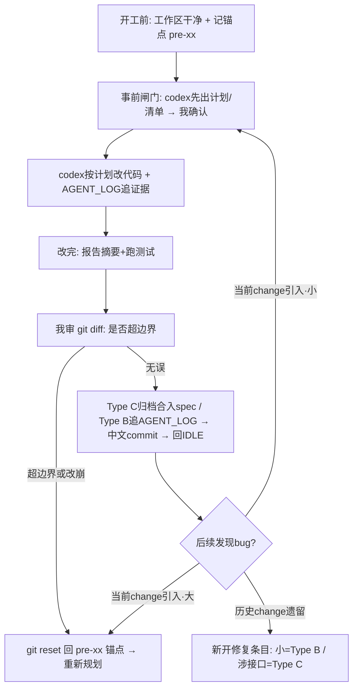

# Vibecoding Playbook · 个人 AI 协作开发手册

> 适用项目：Enterprise RAG QA System（及后续同类个人项目）
> 配套治理：AGENTS.md（Type 分级）、openspec/（change 生命周期）、.ai/ACTIVE_TASK.md（唯一活动指针）、.ai/AGENT_LOG.md（只追加证据）
> 文档性质：长期沿用的"协作方法论"，与 iteration-blueprint.md（方向）互补——蓝图管"往哪走"，本手册管"怎么走得稳"。
> 状态日期：2026-07-14

## 0. 一句话原则

把人工审查点从"事后看 diff"前移到"事前审计划"，并为每个改动建立可干净回滚的 git 锚点；AGENT_LOG 记"做了什么"，git 锚点管"怎么退回去"，两者配合形成可追溯、可回退的迭代闭环。

## 1. 核心工作流（每个 change 通用）

标准闭环分六步，串行推进，一次只激活一个 change：

- **① 开工前置**：确认工作区干净、记录当前 commit hash（或打轻量 tag，如 `pre-B0`）作为回滚锚点；让 codex 先报告仓库最新状态（git log / git status）。工具链不明时先跑本地 `Preflight`，避免把 PATH/依赖问题误判成代码问题。
- **② 事前闸门（关键加固）**：让 codex 先输出"执行计划 / 待改清单"（碰哪些文件、改成什么、影响面），并明确本轮是 `Agent 提交`还是`用户手动提交`，经我确认后才允许改代码。Type C 的事前闸门天然是 proposal/design——先审方向，别等 tasks 跑完才审。
- **③ 执行**：codex 按已确认的计划改真实代码，边做边在 AGENT_LOG 追加执行证据；执行记录先写 `Commit: pending`。
- **④ 收尾报告**：codex 报告改动摘要 + 跑测试结果（报告提升/持平/回退，不承诺一定达标）。
- **⑤ 人工审 diff**：我亲自看 `git diff`，重点检查是否超出既定边界。
- **⑥ 定版**：Type C 归档 change + spec delta 合入 baseline + ACTIVE_TASK 回 IDLE；Type B 追加 AGENT_LOG。按事前约定的提交责任完成中文 commit，提交前确认暂存区无无关改动；下一次仓库写操作开始时追加上一执行提交的真实 hash。

回到 IDLE（Type C）或干净工作区（Type B），才允许开下一个。

## 2. Type 分级速查

- **Type A（只读）**：复核、扫描、审计。不建 change 目录、不改代码、不改 ACTIVE_TASK。
- **Type B（小范围维护）**：局部修复、构建修复、日志脱敏等。不建 change 目录、不写 proposal.md，只在完成后追加 AGENT_LOG。
- **Type C（重大变更）**：涉及接口/权限/持久化/spec 语义。必须走完整 openspec 生命周期：建 `openspec/changes/<id>/`（proposal/design/tasks/spec delta）、置 ACTIVE_TASK 为 ACTIVE、完成经确认后归档、spec delta 合入 baseline。

判定拿不准时的经验法则：改了 API / 权限 / 数据持久化 / spec 语义 → 一律按 Type C。

## 3. 七条加固纪律

### 3.1 事前闸门：先出计划，我确认后再动手

在写任何代码前，让 codex 先产出可审查的计划物（Type B 是"待改清单"，Type C 是 proposal/design）。我把关的是"方向对不对、边界有没有越"，而不是等错误写进代码后再善后。计划未确认，禁止改代码。

### 3.2 git 锚点：每个 change 开工前建立可回滚点

正式改代码前，确保工作区干净并记录当前 commit hash（或打 `pre-<change-id>` 轻量 tag）。一旦改崩，可干净 `git reset` / `git revert` 回锚点，避免多个 change 的改动搅在一起、无法定位。

### 3.3 禁止清单：提示词不只写"做什么"，更要写"不许碰什么"

codex 的自由发挥多发生在"没说不能做"的灰色地带。每个任务的提示词都要显式列出：本次不许改的东西（接口 / 依赖版本 / 鉴权 / 无关重构），以及提交纪律（commit 前确认暂存区只含目标文件、发现无关改动就停下请示，不擅自一起提交）。

### 3.4 验收报告事实，不承诺达标

涉及评测 / 指标的 change（如 reranker A/B、评测门禁、隔离评测），验收话术统一为"跑同一评测集，报告提升/持平/回退；若回退必须解释原因，由我决定是否回滚"。禁止写"指标必须提升"——那会诱导过拟合评测集，污染用于面试叙事的数据。指标是验收证据，不是必达承诺。

### 3.5 提交责任前置

每个任务的事前闸门必须明确二选一：`Agent 提交`或`用户手动提交`。选择 Agent 提交时，Agent 仅暂存已确认的目标文件，提交前再次检查暂存区；选择用户手动提交或未写明时，Agent 不执行 `git add` / `git commit`，只提供中文 message。push、PR、发布和部署不随提交授权自动放开。

### 3.6 验证命令授权与工具链预检

Agent 可直接运行现有项目的 Maven/npm 验证命令，包括 compile、test、package、build、lint，以及解析 POM/lockfile 已声明版本所需的正常依赖下载，无需逐次请示。该授权不允许新增/升级依赖、`npm publish`、部署、push，也不允许绕过 RAG 外部调用安全闸去执行 provider、embedding、rerank、ask 或 judge。

工具链不明时先运行：

```powershell
powershell -NoProfile -ExecutionPolicy Bypass -File scripts/run_local_quality_gates.ps1 -Mode Preflight
```

`Preflight` 只报告 Git/Java/Maven/Python/Node/npm 与前端依赖状态，不安装工具、退出成功、不作为阻塞门禁。需要回归验证时按需运行 `SensitiveLogs`、`FrontendBuild` 或聚合 `All`；敏感日志门禁是启发式防线，不替代人工审计。

### 3.7 AGENT_LOG 两段式

执行阶段只追加事实记录并写 `Commit: pending`。提交完成后，在下一次仓库写操作开始时追加一条“提交补录”，记录上一执行提交的真实 hash，不回头修改历史。若必须立即闭环，可单独创建纯日志补录提交；该补录提交只承载上一提交 hash，不递归记录自己的 hash。

## 4. Bug 处理规程

任何 bug 修复都遵循：**先复现 → 再定位根因 → 最后才改**，并在 AGENT_LOG 写清"这个 bug 之前为什么漏了、以后怎么防"（尽量补一条回归测试），把 bug 转化为可讲的工程反思。

按来源分两类处理：

- **当前 change 引入的 bug**：不要在同一 change 里反复打补丁越描越黑。小问题在当前 change 内定位修复（先说清根因再改）；大问题或已改乱，直接 `git reset` 回开工锚点，重新规划再来。
- **已归档历史 change 遗留的 bug**：不改旧 change。按严重性新开修复条目——小的当 Type B（改完追加 AGENT_LOG）；涉及接口 / spec 语义的当 Type C（走完整 openspec 流程）。这样每次修复独立留痕，不破坏已冻结的历史。

## 5. 收尾与异常处理节奏图



## 6. 可复用提示词模板

### 6.1 Type A · 只读复核 / 扫描

用途：文档冻结前复核、代码现状审计、方向校验。

- 声明本轮为 Type A 只读；禁止创建/修改/归档 openspec/changes、禁止改 ACTIVE_TASK（保持 IDLE）、禁止追加 AGENT_LOG、禁止改任何代码或 spec、禁止运行测试、禁止外部调用。
- 要求所有关键结论附文件路径 + 行号作为证据；对每项能力三态标注（已实现 / 半成品或未验证 / 不存在）。
- 结论必须明确：可通过 / 不可通过；若不可通过，列出剩余阻塞项及其代码或 spec 依据。
- 结尾复述：ACTIVE_TASK 仍为 IDLE、未建 change、未改代码、未追加 AGENT_LOG。

### 6.2 Type B · 小范围维护执行

用途：日志脱敏、构建修复等局部改动。

- 声明本轮为 Type B；按 AGENTS.md 不建 change 目录、不写 proposal.md，只在完成后追加 AGENT_LOG。
- 第一步（事前闸门）：先确认仓库最新状态，必要时运行工具链 `Preflight`；输出"待改清单"（文件 + 行号 + 现状 + 建议改法），并写明 `Agent 提交`或`用户手动提交`，给我确认；确认前不得改任何代码。
- 第二步：按清单逐处修改，不改业务逻辑、不动接口、不做无关重构。
- 第三步：Agent 直接运行相关 Maven/npm 验证并报告结果；在 AGENT_LOG 追加记录（改了哪些文件 + 一句大白话"改前坏事 / 改后不同" + 如何验证 + `Commit: pending`）；按已确认的提交责任处理中文 commit，提交前确认暂存区无无关改动，有则停下报告。
- 第四步：下一次仓库写操作开始时追加上一执行提交的真实 hash，不回改历史。
- 禁止清单：创建 openspec/changes 目录、把任务当 Type C、修改 spec、超出既定范围改其它东西。

### 6.3 Type C · 重大变更（分阶段）

用途：认证、故障契约、租户隔离、MCP、Router 等主线 change。

阶段一（proposal/design，事前闸门）：

- 声明启动某个 Type C change；先在 `openspec/changes/<id>/` 生成 proposal（含"用户故事：改前坏事 → 改后不同"）+ design + tasks + spec delta 草案，置 ACTIVE_TASK 为 ACTIVE。
- 明确本 change 的提交责任：`Agent 提交`或`用户手动提交`；未明确时默认用户手动提交。
- 此阶段不改业务代码；把 proposal/design 交我审。涉及外部调用的（embedding/rerank/judge/ask），在此阶段就说明调用量 / 数据出站 / 模型 / 限流 / 费用及零费用依据并取得授权。

阶段二（实现，我确认 design 后）：

- 记录开工锚点（pre-<id>）。
- 按 tasks 改代码，边做边追加 AGENT_LOG。
- 涉及指标的验收：跑同一评测集，报告提升/持平/回退；回退须解释，由我决定是否回滚。
- 禁止清单：超出本 change scope 改其它模块、擅自升级无关依赖、把未授权的外部调用接进来。

阶段三（收尾）：

- 报告改动摘要 + 测试结果；我审 diff。
- 无误后归档 change、spec delta 合入 baseline、ACTIVE_TASK 回 IDLE；按已确认的提交责任完成中文 commit，确认暂存区干净；下一次仓库写操作开始时补录执行提交 hash。

### 6.4 写任务 · 文档定版 / 提交（明确授权）

用途：冻结蓝图、更新治理文档等纯文档写操作。

- 明确列出允许编辑的文件与具体改法，要求正文其余内容一字不改。
- 明确提交责任：`Agent 提交`或`用户手动提交`；未明确时默认用户手动提交。
- 要求同步在 AGENT_LOG 追加事件记录。
- 按已确认的提交责任处理中文 commit；提交前 git status / git diff 确认暂存区只含目标文件，发现我未提交的无关改动则停下报告、不一起提交。
- 禁止：改代码 / spec、创建 change 目录、把 ACTIVE_TASK 改为 ACTIVE、运行测试、外部调用。

## 7. 提交信息约定

- 全部使用中文 commit message。
- 前缀参考：`docs:`（文档）、`fix:`（缺陷/脱敏）、`feat:`（新能力）、`test:`（测试）、`refactor:`（重构）。
- 一个 commit 对应一个可解释的最小改动单元；Type C 的归档、spec 合入尽量单独成 commit，便于回溯。
- 提交前始终确认暂存区不含未授权的无关改动。
- 事前未明确提交责任时，默认 Agent 不暂存、不提交；push、PR、发布和部署需要独立授权。

## 8. 与治理文件的关系

- **iteration-blueprint.md**：方向与 change 序列（往哪走）。
- **本 playbook**：每个 change 怎么走得稳（协作方法论）。
- **AGENTS.md**：Type 分级与协作硬规则（冲突时以它为准）。
- **openspec/**：Type C 的 proposal/design/tasks/spec delta 与 change 生命周期。
- **.ai/ACTIVE_TASK.md**：唯一活动指针，非 IDLE 即表示有 change 在进行。
- **.ai/AGENT_LOG.md**：只追加的执行证据链，配合 git 锚点实现可追溯 + 可回退。
